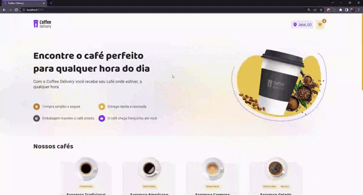

  
  
  <h2> <strong>Coffee Delivery</strong> </h2>

  <h3>Os melhores cafés para o seu dia</h3>

   [Introdução](#-introdução) |
   [Utilização](#-como-jogar) |
   [Tecnologias Utilizadas](#-tecnologias-utilizadas) 

---

# 👨🏻‍💻 Introdução

## Objetivo

Essa aplicação busca simular uma página de delivery de cafés totalmente responsiva e desenvolvida em ReactJs

A criação dessa aplicação foi com o intuito de praticar e aprender mais sobre o desenvolvimento em [ReactJS](https://react.dev/) e suas tecnologias.

## Esse repositório possui

- Todo os arquivos de desenvolvimento da aplicação;
- Estruturação em componentes;
- Icons e SVGs utilizados na aplicação.

## Projeto

Esse projeto foi desenvolvido durante o curso Ignite da [Rocketseat](https://rocketseat.com.br/).

 

# ☕ Utilização

  
  

    
  

   

Escolha quais e quantos cafés você irá querer.

Vá para o carrinho e faça seu checkout.

Aguarde seu pedido chegar.

 

# 🚀 Tecnologias/Bibliotecas utilizadas

- [ReactJS](https://react.dev/)
- [Zod](https://zod.dev/)
- [Immer](https://immerjs.github.io/immer/)
- [React Imask](https://github.com/uNmAnNeR/imaskjs/tree/master)
- [Phosphor Icons](https://phosphoricons.com/)
- [React Hook Form](https://react-hook-form.com/)
- [Styled-components](https://styled-components.com/)

---

Made by

- [**Gabriel Carvalho**](https://github.com/GabrielCarvf) 🤘🏻|  [LinkedIn](https://www.linkedin.com/in/gabriel-carvalho-5ba636182/)
